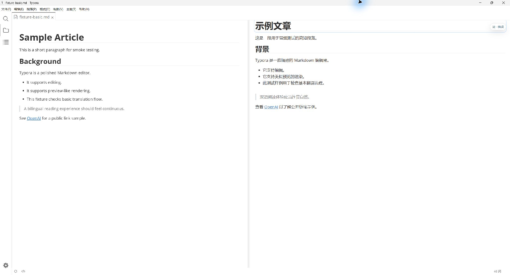

# Typora Side-by-Side Translator

在 Typora 中编辑原始 Markdown，同时在旁边阅读生成的中文、英文、日文或韩文译文。

[English](./README.md)



_Windows 上 Typora 1.14.9 的实拍界面：左侧保持原生编辑，右侧并排显示缓存的只读译文。_

> **Alpha 阶段：**核心流程已在下方 Windows 组合中运行。插件尚未进入社区插件市场，也尚未完成外部用户测试。

当前开发版本：**`0.1.0-alpha.3`**。插件设置页顶部也会显示实际安装版本。

## 为什么做这个插件

- **不离开 Typora。** 左侧仍是 Typora 原生编辑区，右侧是只读译文窗格。
- **只在明确操作后翻译。** 输入时不会发送请求，全文翻译和脏区刷新都需要用户主动执行。
- **不污染原文目录。** 每种目标语言使用独立插件缓存，只有主动导出时才生成带语言后缀的干净 Markdown。
- **可选择目标语言。** 设置页和译文窗格都支持简体中文、繁体中文、英文、日文和韩文。
- **可选择插件界面语言。** 界面可自动跟随 Typora，也可独立选择英文、简体中文、繁体中文、日文或韩文，不与翻译目标语言绑定。
- **只更新发生变化的内容。** 插件按 Markdown 块跟踪变化，并保护人工修改过的缓存译文，避免被静默覆盖。
- **尽量保留 Markdown 结构。** 标题、段落、列表、引用、表格、链接、代码、公式和 HTML 使用各自的处理规则。
- **按一篇文档连续阅读。** 两栏共享 Typora 主滚动区域，并支持拖拽及 `40/60`、`50/50`、`60/40` 比例。

## 快速开始

### 环境要求

| 组件 | 当前已验证环境 |
|---|---|
| 操作系统 | Windows 10/11 |
| Typora | 1.14.9 |
| [typora-community-plugin](https://github.com/typora-community-plugin/typora-community-plugin) | 2.9.14 |
| 源码安装使用的 Node.js | 24 |

Manifest 的最低门槛为 Typora `1.12.4` 和社区核心 `2.5.28`，但这不代表所有更高版本组合都已验证。当前不支持 macOS 和 Linux。

### 安装已发布的 Alpha 包

先安装 `typora-community-plugin`，打开 [Releases 页面](https://github.com/Eleef/typora-side-by-side-translator/releases)，选择一个已发布版本，并从同一版本下载以下四个文件放在一个目录。仓库源码可能领先于最近发布的 Alpha；验证当前开发版本时请使用下方“从源码安装”。

- `plugin.zip`
- `SHA256SUMS.txt`
- `install-plugin.ps1`
- `doctor.ps1`

完全退出 Typora，在该目录打开 PowerShell，然后执行：

```powershell
$checksumLine = Get-Content .\SHA256SUMS.txt | Where-Object { $_ -match '\s+plugin\.zip$' }
$expectedSha256 = ($checksumLine -split '\s+')[0]
powershell -NoProfile -ExecutionPolicy Bypass -File .\install-plugin.ps1 -PackagePath .\plugin.zip -ExpectedSha256 $expectedSha256
```

安装脚本会检查社区加载器、验证 ZIP 校验和与包结构、安装并启用插件，最后自动执行安装后健康检查。

升级已有安装前，请先在插件设置中检查 API key 保存方式。新版默认使用“本地保存（明文，默认）”，覆盖安装会保留该设置。若主动选择“不保存（仅当前 Typora 会话）”，关闭 Typora 后 key 无法恢复，安装器会停止并提示先切回本地保存；若接受安装后重新输入，可在安装命令末尾显式增加 `-AcceptSessionCredentialLoss`。安装器会校验持久化设置文件在升级前后完全不变。

### 从源码安装

先安装 `typora-community-plugin`，完全退出 Typora，然后执行：

```powershell
npm ci
npm run ci
powershell -ExecutionPolicy Bypass -File .\scripts\doctor.ps1 -Mode Community
powershell -ExecutionPolicy Bypass -File .\scripts\install-plugin.ps1
```

安装脚本会检查社区插件市场加载器、复制并启用插件、避免向 `plugins.json` 写入社区核心无法解析的 UTF-8 BOM，并在安装后再次检查。安装目录为：

```text
%USERPROFILE%\.typora\community-plugins\plugins\eleef.typora-side-by-side-translator
```

### 使用

1. 在 Typora 中打开已保存的本地 `.md` 文件。
2. 打开社区插件设置，分别选择界面语言和目标语言，再填写 `baseUrl`、`apiKey`、`model` 和 `timeoutMs`。
3. API key 默认“本地保存（明文）”，关闭、重启或更新后仍可恢复；同一 Windows 用户下的其他程序可以读取。若本机静态保密高于便利性，可选择“不保存（仅当前 Typora 会话）”。
4. 打开社区命令面板；在已验证环境中快捷键是 `F2`。
5. 搜索 **Side-by-Side Translator**，执行 **Toggle Pane**。
6. 执行 **Translate Current File**，生成当前目标语言的缓存译文。
7. 修改原文后，需要更新时执行 **Refresh Stale Blocks**。
8. 请求运行期间可执行 **Cancel Translation**，停止任务且不覆盖现有缓存。
9. 执行 **Export Target File**，在原文旁生成带语言后缀的干净 Markdown。

## 工作方式

```text
已保存的 Markdown
        |
        v
提取 Markdown 块 --------> OpenAI 兼容 /chat/completions 接口
        |                                  |
        |                                  v
        +------------------------ 缓存译文与映射文件
                                           |
                           +---------------+---------------+
                           v                               v
                     右侧只读译文窗格                 导出干净 *.zh.md
```

原文语言由配置的模型自动识别。目标语言可选择简体中文（`.zh.md`）、繁体中文（`.zh-TW.md`）、英文（`.en.md`）、日文（`.ja.md`）或韩文（`.ko.md`）。切换语言只读取对应的独立缓存，不会自动发送翻译请求。插件支持 OpenAI 兼容远程接口，也可连接仅在本机回环地址监听的模型服务。代码、公式和 HTML 块原样保留；链接文本可以翻译，但网址不会改变。

## 数据安全

- 只有执行 **Translate Current File** 或 **Refresh Stale Blocks** 后才会发送 Markdown。
- 第一次联网翻译前，插件会显示当前配置的服务并要求用户明确同意发送数据；拒绝后不会发出请求。
- 请求由 Typora 直接发送到用户配置的服务，本项目不运营中转服务器。
- 远程地址必须使用 HTTPS；只有 `localhost`、`127.0.0.1` 和 `::1` 可以使用 HTTP。
- 本地插件设置是默认值，会在当前用户的社区插件数据中明文保存 API key；同一 Windows 用户下运行的其他程序可以读取。可选的会话模式只在内存中保留 key，关闭、重启或更新 Typora 后无法恢复。
- 更换 API 服务来源会清除内存和已保存的 key；切回会话模式或点击显式删除也会移除已保存值。
- 覆盖安装或卸载插件代码都不会删除社区插件设置、缓存和日志。升级安装器会验证持久设置文件安装前后完全一致；但只存在内存中的会话 key 会随 Typora 关闭而消失。如需清除本地数据，应在卸载前通过插件设置执行 **清除全部插件本地数据**。
- 翻译缓存位于 `%USERPROFILE%\.typora\community-plugins\settings\data\eleef.typora-side-by-side-translator\translations`。
- **清理当前文档** 只删除当前目标语言的缓存译文和映射。设置页还可以清理全部翻译缓存、诊断日志或全部插件本地数据；已导出的 Markdown 不会被删除。
- 诊断日志会隐藏凭据、本机路径、网址查询参数和敏感错误详情。
- 右侧只读窗格会转义 Markdown 原始 HTML，并用严格白名单净化渲染结果；可执行标记和外部资源元素会被移除。

翻译服务会收到本次选择发送的 Markdown 块。处理敏感文档前，应先确认该服务的数据保留和隐私政策。已记录的同意状态可随“全部插件本地数据”一起清除。

插件会保守处理旧缓存和损坏缓存。旧块标识格式的缓存仍可读取和导出，但脏区刷新不会覆盖它；缓存译文或映射文件缺失、损坏或不可读时，插件会在网络请求和文件写入前停止。只有用户明确执行全文翻译，才会重建缓存。

## 当前限制

- 只支持已保存的本地 `.md` 文件，不支持未命名文档和远程文件。
- 当前不提供原文语言手动指定或自动选择目标语言，原文识别交给配置的模型。
- 右侧窗格只读，不会逐键自动翻译。
- Alpha 版本只支持 Windows。
- Alpha 已支持从 GitHub Release 安装；社区市场安装将在正式 `0.1.0` 发布后推进。

## 故障排查

先运行健康检查：

```powershell
powershell -ExecutionPolicy Bypass -File .\scripts\doctor.ps1
```

Typora 更新可能替换 `typora-community-plugin` 修改过的应用 HTML，导致插件市场和全部社区插件消失。如果健康检查显示 `community-market.injection` 失败，请完全关闭 Typora，并针对更新后的 Typora 重新安装当前官方社区加载器。不要用旧版 Typora HTML 覆盖新版文件。

提交问题时，请先使用 `-RedactPaths` 重新运行健康检查，再通过仓库中的 Bug 或 Compatibility 表单附上这份脱敏摘要、Typora 版本、社区核心版本和复现步骤。不要提交 API key 或未处理的原始日志。

## 开发与验证

```powershell
npm run typecheck
npm test
npm run build
npm run package
npm run test:windows-installer
npm run version:set -- <version>
$env:RELEASE_TAG = "<version>"
npm run check:release
```

`npm run package` 当前会生成包含 `manifest.json`、`main.js`、`style.css` 和 `locales/` 目录的 `release/plugin.zip`，五套界面语言资源作为独立文件随包发布。安装器和发布检查会逐个校验这些语言文件。完整真机检查见 [VERIFICATION.md](./VERIFICATION.md)，贡献代码前请阅读 [CONTRIBUTING.md](./CONTRIBUTING.md)，安全问题报告方式见 [SECURITY.md](./SECURITY.md)。

仓库还包含符合 GitHub 社交分享图尺寸的 [social-preview.png](./docs/assets/social-preview.png)，可在仓库设置中直接上传。

## 许可证

[MIT](./LICENSE) © Eleef
